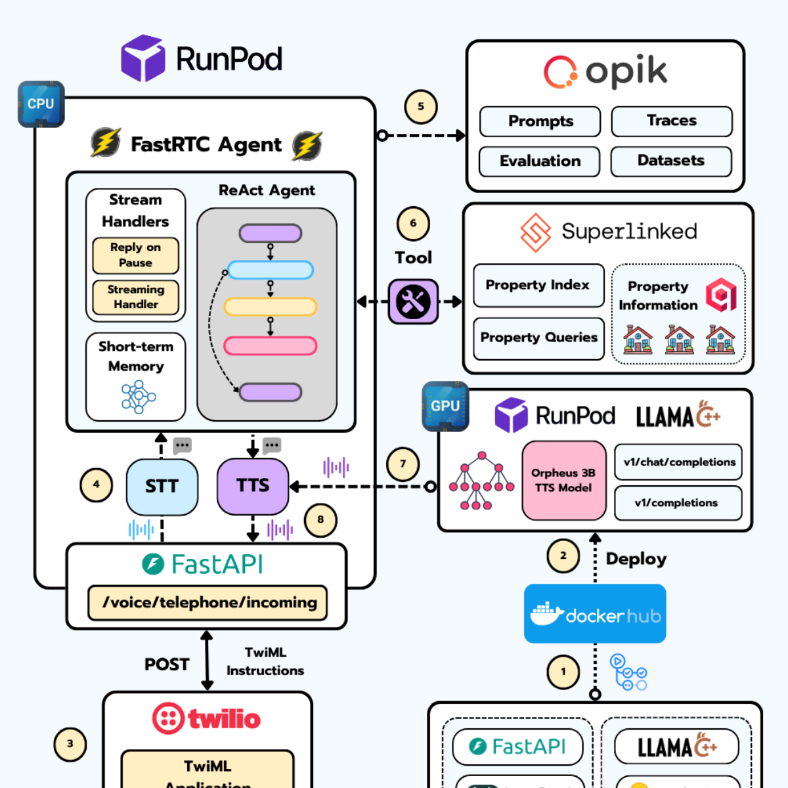
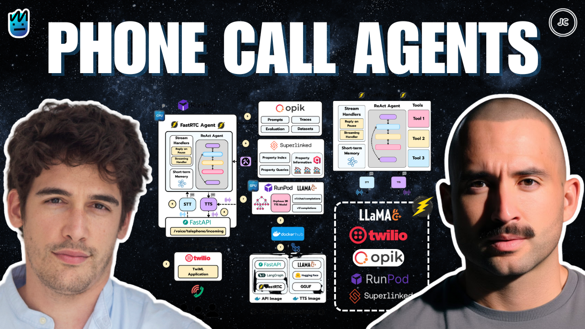
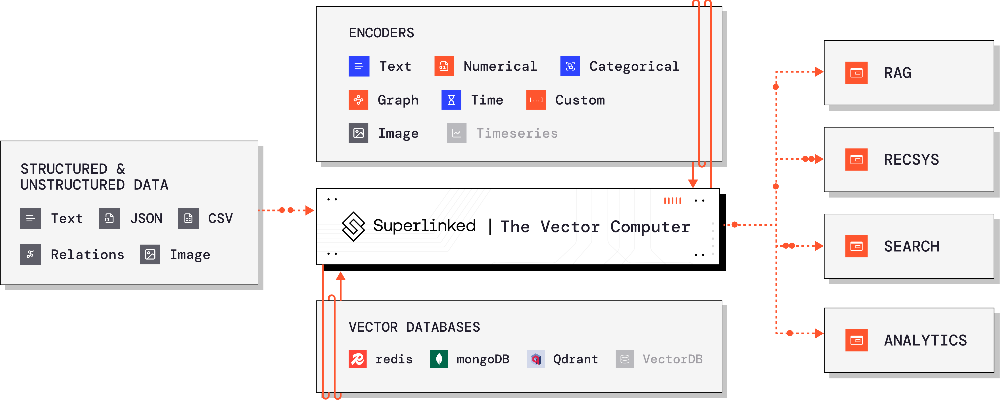
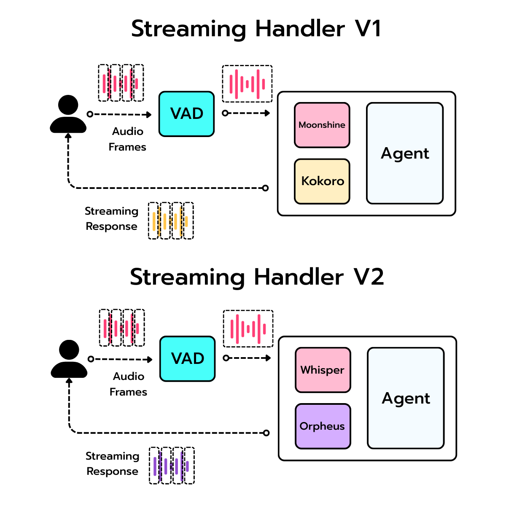
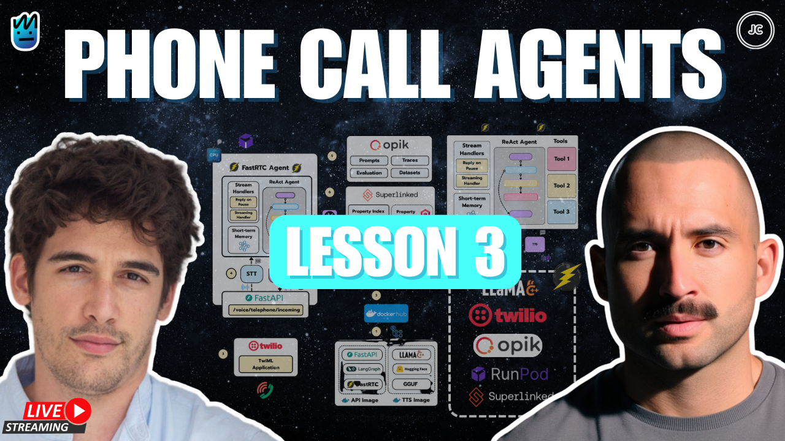
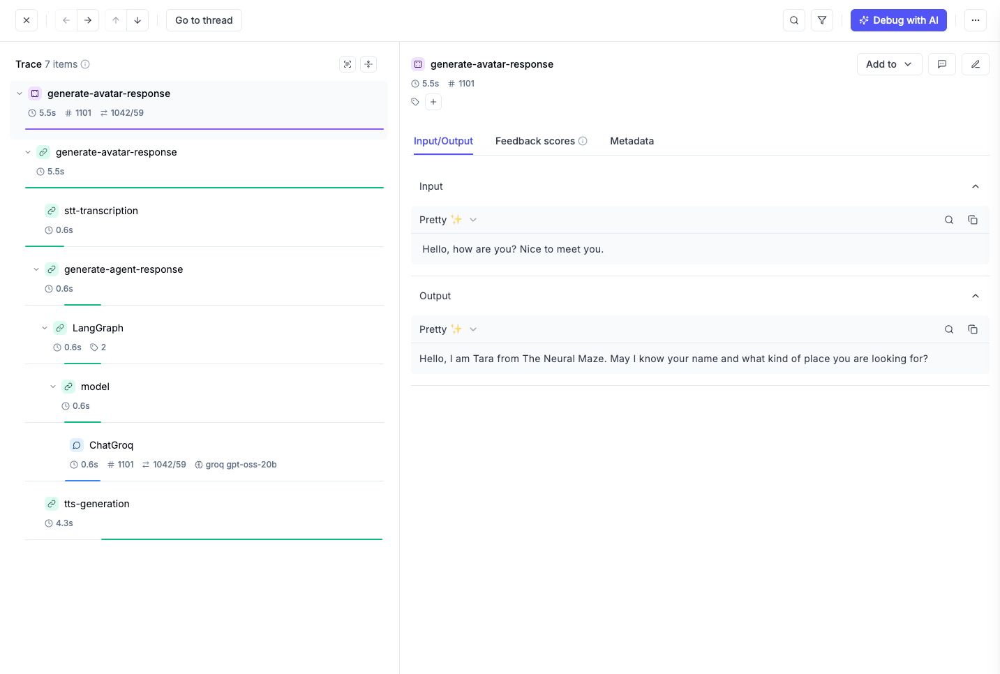

<div align="center">
  <h1>☎️ Phone Calling Agents Course ☎️</h1>
  <h3>How to build an Agent Call Center using FastRTC, Superlinked, Twilio, Opik & RunPod</h3>
</div>

</br>

<p align="center">
    
</p>


## Table of Contents

- [Table of Contents](#table-of-contents)
- [Course Overview](#course-overview)
- [Who is this course for?](#who-is-this-course-for)
- [Course Breakdown: Week by Week](#course-breakdown-week-by-week)
- [Getting Started](#getting-started)
- [Lesson 0: Project Overview and Architecture](#lesson-0-project-overview-and-architecture)
- [Lesson 1: Building Realtime Voice Agents with FastRTC](#lesson-1-building-realtime-voice-agents-with-fastrtc)
- [Lesson 2: The Missing Layer in Modern AI Retrieval](#lesson-2-the-missing-layer-in-modern-ai-retrieval)  
- [Lesson 3: Improving STT and TTS Systems](#lesson-3-improving-stt-and-tts-systems)
- [Lesson 4: Deploying a multi-avatar Voice Agent with Full Tracing](#lesson-4-deploying-a-multi-avatar-voice-agent-with-full-tracing)
- [The tech stack](#the-tech-stack)
- [Contributors](#contributors)
- [License](#license)


## Course Overview

This isn't your typical plug-and-play tutorial where you spin up a demo in five minutes and call it a day. 

Instead, we're building a **real estate company**, but with a twist … the employees will be **realtime voice agents**!

By the end of this course, you'll have a system capable of:

* ☎️ Receive inbound calls with Twilio
* 📞 Make outbound calls through Twilio
* 🏠 Search live property data using Superlinked
* ⚡ Run realtime conversations powered by FastRTC
* 🗣️ Transcribe speech instantly with Moonshine + Fast Whisper
* 🎙️ Generate lifelike voices using Kokoro + Orpheus 3B
* 🚀 Deploy open-source models on Runpod for GPU acceleration


Excited? Let's get started! 

---

<table style="border-collapse: collapse; border: none;">
  <tr style="border: none;">
    <td width="20%" style="border: none;">
      <a href="https://theneuralmaze.substack.com/" aria-label="The Neural Maze">
        
      </a>
    </td>
    <td width="80%" style="border: none;">
      <div>
        <h2>📬 Stay Updated</h2>
        <p><b><a href="https://theneuralmaze.substack.com/">Join The Neural Maze</a></b> and learn to build AI Systems that actually work, from principles to production. Every Wednesday, directly to your inbox. Don't miss out!</p>
      </div>
    </td>
  </tr>
</table>

<p align="center">
  <a href="https://theneuralmaze.substack.com/">
    
  </a>
</p>

<table style="border-collapse: collapse; border: none;">
  <tr style="border: none;">
    <td width="20%" style="border: none;">
      <a href="https://www.youtube.com/@jesuscopado-en" aria-label="Jesus Copado YouTube Channel">
        
      </a>
    </td>
    <td width="80%" style="border: none;">
      <div>
        <h2>🎥 Watch More Content</h2>
        <p><b><a href="https://www.youtube.com/@jesuscopado-en">Join Jesús Copado on YouTube</a></b> to explore how to build real AI projects—from voice agents to creative tools. Weekly videos with code, demos, and ideas that push what's possible with AI. Don't miss the next drop!</p>
      </div>
    </td>
  </tr>
</table>

<p align="center">
  <a href="https://www.youtube.com/@jesuscopado-en">
    
  </a>
</p>

---

## Who is this course for?

This course is for Software Engineers, ML Engineers, and AI Engineers who want to level up by building complex end-to-end apps. It's not just a basic "Hello World" tutorial—it's a deep dive into making **production-ready voice agents**.


## Course Breakdown: Week by Week

Each week, you'll unlock **a new chapter of the journey**. You'll get:

* 🧾 A Substack article that walks through the concepts and code in detail
* 💻 A new batch of code pushed directly to this repo
* 🎥 A Live Session where we explore everything together

Here’s what the upcoming weeks look like 👇


| Lesson Number | Title | Article | Code | Live Session |
|:-------------:|:--------------:|:------------:|:------------:|:-----------:|
| <div align="center">0</div> | <a href="https://theneuralmaze.substack.com/p/the-architecture-of-realtime-phone">Project overview and architecture</a> | <a href="https://theneuralmaze.substack.com/p/the-architecture-of-realtime-phone"></a> | <a href="https://github.com/neural-maze/realtime-phone-agents-course/tree/week0">Week 0</a> | <a href="https://theneuralmaze.substack.com/p/the-architecture-of-phone-calling"></a> |
| <div align="center">1</div> | <a href="https://theneuralmaze.substack.com/p/building-realtime-voice-agents-with">Building Realtime Voice Agents with FastRTC</a> | <a href="https://theneuralmaze.substack.com/p/building-realtime-voice-agents-with"></a> | <a href="https://github.com/neural-maze/realtime-phone-agents-course/tree/week1">Week 1</a> | <a href="https://theneuralmaze.substack.com/p/building-realtime-voice-agents-with-52e"></a> |
| <div align="center">2</div> | <a href="https://theneuralmaze.substack.com/p/the-missing-layer-in-modern-ai-retrieval">The Missing Layer in Modern AI Retrieval</a> | <a href="https://theneuralmaze.substack.com/p/the-missing-layer-in-modern-ai-retrieval"></a> | <a href="https://github.com/neural-maze/realtime-phone-agents-course/tree/week2">Week 2</a> | <a href="https://theneuralmaze.substack.com/p/the-missing-layer-in-modern-ai-retrieval-af7"></a> |
| <div align="center">3</div> | <a href="https://theneuralmaze.substack.com/p/how-to-deploy-stt-and-tts-systems">Improving STT and TTS Systems</a> | <a href="https://theneuralmaze.substack.com/p/how-to-deploy-stt-and-tts-systems"></a> | <a href="https://github.com/neural-maze/realtime-phone-agents-course/tree/week3">Week 3</a> | <a href="https://theneuralmaze.substack.com/p/how-to-deploy-stt-and-tts-systems-160"></a> |
| <div align="center">4</div> | <a href="https://theneuralmaze.substack.com/p/deploying-a-multi-avatar-voice-agent">Deploying a multi-avatar Voice Agent with Full Tracing</a> | <a href="https://theneuralmaze.substack.com/p/deploying-a-multi-avatar-voice-agent"></a> | <a href="https://github.com/neural-maze/realtime-phone-agents-course/tree/week4">Week 4</a> | <a href="https://theneuralmaze.substack.com/p/deploying-a-multi-avatar-voice-agent-38d"></a> |

---

## Getting Started

Before diving into the lessons, make sure you have everything set up properly:

1. 📋 **Initial Setup**: Follow the instructions in [`docs/GETTINGS_STARTED.md`](docs/GETTINGS_STARTED.md) to configure your environment and install dependencies.
2. 📚 **Learn Lesson by Lesson**: Once setup is complete, come back here and follow the lessons in order.

Each lesson builds on the previous one, so it's important to follow them sequentially!

---

## Lesson 0: Project Overview and Architecture

<p align="center">
    
</p>

**Goal**: Understand the big picture and architecture of the realtime phone agent system.

### Steps:

1. 📖 Read the [Substack article](https://theneuralmaze.substack.com/p/the-architecture-of-realtime-phone) to understand the overall architecture
2. 🎥 Watch the [Live Session recording](https://theneuralmaze.substack.com/p/the-architecture-of-phone-calling) for a deeper dive

This lesson sets the foundation for everything that follows!

---

## Lesson 1: Building Realtime Voice Agents with FastRTC

<p align="center">
    
</p>

**Goal**: Build your first working voice agent using FastRTC and integrate it with Twilio.

### Steps:

1. 📖 **Read the Article**: Start with the [Substack article](https://theneuralmaze.substack.com/p/building-realtime-voice-agents-with) to understand FastRTC fundamentals
2. 📓 **Work Through the Notebook**: Open and run through [`notebooks/lesson_1_fastrtc_agents.ipynb`](notebooks/lesson_1_fastrtc_agents.ipynb) to get hands-on experience
3. 💻 **Explore the Code**: Dive into the repository code to see how everything is implemented
4. 🚀 **Run the Applications**: Try both deployment options:

#### Option A: Gradio Application (Quick Demo)

Run the Gradio interface (check out demo videos in the [Substack article](https://theneuralmaze.substack.com/p/building-realtime-voice-agents-with)):

```bash
make start-gradio-application
```

This starts an interactive web interface where you can test the voice agent locally.

> **_NOTE:_**  If you get the error 'No such file or directory: 'ffprobe', just install _ffmpeg_ in your system to solve it

#### Option B: FastAPI Call Center (Production-Ready)

For a production-ready setup that can receive real phone calls:

**Step 1**: Start the call center application

```bash
make start-call-center
```

This starts a FastAPI application using Docker Compose on port 8000.

**Step 2**: Expose your local server to the internet

```bash
make start-ngrok-tunnel
```

Or manually:

```bash
ngrok http 8000
```

**Step 3**: Connect to Twilio

Follow the instructions in the [article](https://theneuralmaze.substack.com/p/building-realtime-voice-agents-with) to:
- Configure your Twilio account
- Connect your ngrok URL to Twilio
- Start receiving real phone calls!

---

## Lesson 2: The Missing Layer in Modern AI Retrieval

<p align="center">
    
</p>

**Goal**: Learn how to implement advanced search capabilities for realtime voice agents using Superlinked to handle complex, multi-attribute queries.

### Steps:

1. 📖 **Read the Article**: Start with the [Substack article](https://theneuralmaze.substack.com/p/the-missing-layer-in-modern-ai-retrieval) to understand:
   - Why traditional vector search isn't enough for multi-attribute queries
   - How Superlinked combines different data types (text, numbers, categories) into a unified search space
   - The limitations of metadata filters, multiple searches, and re-ranking approaches

2. 📓 **Work Through the Notebook**: Open and run through [`notebooks/lesson_2_superlinked_property_search.ipynb`](notebooks/lesson_2_superlinked_property_search.ipynb) to learn:
   - How to define different Space types (TextSimilaritySpace, NumberSpace, CategoricalSimilaritySpace)
   - How to combine spaces into a single searchable index
   - How to dynamically adjust weights at query time

3. 💻 **Explore the Code**: Dive into the repository to see how Superlinked integrates with our voice agent:
   - Check out `src/realtime_phone_agents/infrastructure/superlinked/` for the implementation
   - Review `src/realtime_phone_agents/agent/tools/property_search.py` to see how the search tool is exposed to the agent
   
   _We'll explore the code in detail during the Live Session!_

4. 🚀 **Test the Complete System**: Now it's time to see everything work together!

   **Step 1**: Start the call center application

   ```bash
   make start-call-center
   ```

   **Step 2**: Expose your local server (if not already running)

   ```bash
   make start-ngrok-tunnel
   ```

   **Step 3**: Call your Twilio number and test the property search

   Try asking the agent:
   
   > _"Do you have apartments in Barrio de Salamanca of at most 900,000 euros?"_

   Wait for the response. The agent should find and return information about the only apartment in the dataset ([`data/properties.csv`](data/properties.csv)) that meets these criteria!

   This demonstrates how the voice agent can now handle complex queries combining location (Barrio de Salamanca) and price constraints (≤ €900,000) in real-time.

---

# Lesson 3: Improving STT and TTS Systems

<p align="center">
    
</p>

**Goal**: Improve the quality of STT and TTS systems used in the voice agent.

### Steps:

1. 📖 **Read the Article**: Start with the [Substack article](https://theneuralmaze.substack.com/p/how-to-deploy-stt-and-tts-systems) to understand the fundamentals of STT and TTS systems, and how to deploy them on Runpod.

2. 📓 **Work Through the Notebook**: Open and run through [`notebooks/lesson_3_stt_tts.ipynb`](notebooks/lesson_3_stt_tts.ipynb) to experience how the new `faster-whisper` and `Orpheus 3B` deployments look like.

3. 💻 **Explore the Code**: It's time to see the additions for `week 3`. Check out the new `stt/` and `tts/` modules in `src/realtime_phone_agents/`:

   - **STT (Speech-to-Text)**:
     - `local/`: Implementation using **Moonshine** for local inference.
     - `groq/`: Integration with **Groq's** fast inference API.
     - `runpod/`: Self-hosted **Faster Whisper** implementation.

   - **TTS (Text-to-Speech)**:
     - `local/`: Implementation using **Kokoro** for high-quality local synthesis.
     - `togetherai/`: Integration with **Together AI**.
     - `runpod/`: Self-hosted **Orpheus 3B** implementation.

4. 🐳 **New Docker Images**: We've added two new Dockerfiles to deploy our custom models on RunPod:

   - **`Dockerfile.faster_whisper`**: Builds a container for the **Faster Whisper** model (large-v3). It uses the `speaches-ai/speaches` base image and pre-downloads the model for faster startup.
   - **`Dockerfile.orpheus`**: Builds a container for the **Orpheus 3B** model using `llama.cpp` server with CUDA support, optimized for real-time speech generation.

5. 🚀 **Deploy & Interact**: Ready to test these models? Follow these steps:

   > ⚠️ **IMPORTANT**: Before proceeding, ensure you have completed the setup in [`docs/GETTING_STARTED.md`](docs/GETTING_STARTED.md). This includes setting up your API keys and environment variables (especially for RunPod).

   **Step 1: Deploy to RunPod**
   
   Use the Makefile commands to spin up your GPU pods:
   
   ```bash
   # Deploy Faster Whisper
   make create-faster-whisper-pod
   
   # Deploy Orpheus 3B
   make create-orpheus-pod
   ```
   
   *Note: These scripts will automatically print the endpoint URLs once the pods are ready. Make sure to update your `.env` file with these URLs!*

   **Step 2: Start the Gradio App**
   
   Launch the interactive interface to test different combinations:
   
   ```bash
   make start-gradio-application
   ```

   **Step 3: Experiment!**
   
   In the Gradio interface, you can mix and match different implementations:
   
   - **STT Options**:
     - `Moonshine` (Local)
     - `Whisper` (Groq API)
     - `Faster Whisper` (RunPod - *requires Step 1*)
     
   - **TTS Options**:
     - `Kokoro` (Local)
     - `Orpheus` (Together AI API)
     - `Orpheus` (RunPod - *requires Step 1*)

---

## Lesson 4: Deploying a multi-avatar Voice Agent with Full Tracing

<p align="center">
    
</p>

**Goal**: Deploy a production-ready call center with multiple avatars, full tracing, and Twilio integration for inbound and outbound calls.

### Steps:

1. 📖 **Read the Article**: Start with the [Substack article](https://theneuralmaze.substack.com/p/deploying-a-multi-avatar-voice-agent) to understand:
   - How to build a multi-avatar system with different personas
   - How to implement full tracing of every interaction using Opik
   - How to version prompts and store transcribed conversations
   - How to deploy to Runpod and integrate with Twilio

2. 📓 **Work Through the Notebook**: Open and run through [`notebooks/lesson_4_avatar_system.ipynb`](notebooks/lesson_4_avatar_system.ipynb) to explore:
   - How to define and work with different avatars
   - How each avatar has its own personality, style, and voice
   - How to fetch and use avatars in your application

3. 💻 **Explore the Code**: Check out the new additions for `week 4`:

   - **Avatar System** (`src/realtime_phone_agents/avatars/`):
     - `base.py`: Base Avatar class with system prompt generation and versioning
     - `registry.py`: Utility to list, fetch, and manage avatars
     - `definitions/`: YAML files defining each avatar's personality (dan, jess, leah, leo, mia, tara, zac, zoe)

   - **Observability** (`src/realtime_phone_agents/observability/`):
     - `opik_utils.py`: Utilities for tracing with Opik
     - `prompt_versioning.py`: System for versioning all prompts

   - **Updated Agent** (`src/realtime_phone_agents/agent/fastrtc_agent.py`):
     - Added `@opik.track` decorators to trace every method in the pipeline
     - Tracks STT transcription, LLM responses, tool calls, and TTS generation
     - Stores complete conversation threads in Opik

4. 🚀 **Deploy to Production**: Time to deploy your call center to the cloud!

   > ⚠️ **IMPORTANT**: Make sure your `.env` file includes all required variables from [`docs/GETTING_STARTED.md`](docs/GETTING_STARTED.md), including:
   > - Opik API key for tracing
   > - Qdrant Cloud credentials
   > - Twilio credentials
   > - Runpod API key
   > - All STT/TTS model configurations

   **Step 1: Deploy the Call Center to Runpod**

   ```bash
   make create-call-center-pod
   ```

   This will deploy your FastAPI application to Runpod and give you a URL like:
   ```
   https://your-pod-id.proxy.runpod.net
   ```

   **Step 2: Ingest Properties to Qdrant Cloud**

   ```bash
   make ingest-properties
   ```

   This populates your Qdrant Cloud cluster with property data for the agent to search.

   **Step 3: Configure Twilio**

   - Go to your Twilio TwiML App
   - Replace your ngrok URL with your Runpod URL:
     ```
     https://your-pod-id.proxy.runpod.net/voice/telephone/incoming
     ```
   - Save the configuration

   **Step 4: Test Inbound Calls**

   Call your Twilio number and interact with your deployed agent! The system will:
   - Answer with the avatar you configured (`AVATAR_NAME` in `.env`)
   - Search properties using Superlinked
   - Trace every interaction in Opik
   - Store the full conversation

   **Step 5: Make Outbound Calls**

   You can also make outbound calls programmatically:

   ```bash
   make outbound-call
   ```

   This will trigger a call from your agent to the specified number!

5. 📊 **Monitor with Opik**: Open your Opik dashboard to see:
   - **Traces**: Every step of the conversation pipeline with timing information
   - **Threads**: Complete transcribed conversations stored for analysis
   - **Prompts**: Versioned system prompts for each avatar

   You'll be able to track:
   - How long transcription takes
   - LLM response times
   - Tool call performance
   - TTS generation speed
   - Complete conversation flow

---

## The tech stack

<table>
  <tr>
    <th>Technology</th>
    <th>Description</th>
  </tr>
  <tr>
    <td></td>
    <td>The python library for real-time communication.
</td>
  </tr>
  <tr>
    <td></td>
    <td>Superlinked is a Python framework for AI Engineers building high-performance search & recommendation applications that combine structured and unstructured data.

</td>
  </tr>
  <tr>
    <td></td>
    <td>The end-to-end AI cloud that simplifies building and deploying models.</td>
  </tr>
  <tr>
    <td></td>
    <td>Debug, evaluate, and monitor your LLM applications, RAG systems, and agentic workflows with comprehensive tracing, automated evaluations, and production-ready dashboards.</td>
  </tr>
  <tr>
    <td></td>
    <td>Twilio is a cloud communications platform that enables developers to build, manage, and automate voice, text, video, and other communication services through APIs.</td>
  </tr>
</table>


## Contributors

<table>
  <tr>
    <td align="center"></td>
    <td>
      <strong>Miguel Otero Pedrido | Senior ML / AI Engineer </strong><br />
      <i>Founder of The Neural Maze. Rick and Morty fan.</i><br /><br />
      <a href="https://www.linkedin.com/in/migueloteropedrido/">LinkedIn</a><br />
      <a href="https://www.youtube.com/@TheNeuralMaze">YouTube</a><br />
      <a href="https://theneuralmaze.substack.com/">The Neural Maze Newsletter</a>
    </td>
  </tr>
  <tr>
    <td align="center"></td>
    <td>
      <strong>Jesús Copado | Senior ML / AI Engineer </strong><br />
      <i>Equal parts cinema fan and AI enthusiast.</i><br /><br />
      <a href="https://www.youtube.com/@jesuscopado-en">YouTube</a><br />
      <a href="https://www.linkedin.com/in/copadojesus/">LinkedIn</a><br />
    </td>
  </tr>
</table>

## License

This project is licensed under the MIT License - see the [LICENSE](LICENSE) file for details.


## ❓ FAQ

### What is Phone Calling Agents Course?

**Phone Calling Agents Course** is a comprehensive course that teaches you how to build a production-ready Agent Call Center using FastRTC, Superlinked, Twilio, Opik, and RunPod. The course walks you through building a real estate company with **realtime voice agents** as employees!

### What You Will Learn

| Capability | Technology |
|------------|------------|
| ☎️ Receive inbound calls | Twilio |
| 📞 Make outbound calls | Twilio |
| 🏠 Search live property data | Superlinked |
| ⚡ Realtime conversations | FastRTC |
| 🗣️ Speech-to-Text | Moonshine + Fast Whisper |
| 🎙️ Text-to-Speech | Kokoro + Orpheus 3B |
| 🚀 GPU deployment | RunPod |
| 📊 Tracing & monitoring | Opik |

### Course Structure (5 Lessons)

| Lesson | Topic | Focus |
|--------|-------|-------|
| **Lesson 0** | Project Overview & Architecture | Big picture system design |
| **Lesson 1** | FastRTC Voice Agents | Build realtime voice agent + Twilio |
| **Lesson 2** | Superlinked Search | Multi-attribute property search |
| **Lesson 3** | STT/TTS Systems | Improve transcription & synthesis |
| **Lesson 4** | Multi-avatar Deployment | Production call center with tracing |

### Tech Stack

| Technology | Description |
|------------|-------------|
| **FastRTC** | Python library for real-time communication |
| **Superlinked** | Framework for high-performance search combining structured + unstructured data |
| **RunPod** | End-to-end AI cloud for model deployment |
| **Opik** | LLM tracing, evaluation, and monitoring |
| **Twilio** | Cloud communications platform for voice/video/text APIs |

### Requirements

- Python environment (follow `docs/GETTINGS_STARTED.md`)
- Twilio account (for phone calls)
- RunPod account (for GPU deployment)
- Opik API key (for tracing)
- Qdrant Cloud credentials (for vector storage)
- OpenAI/Together AI API keys (for LLM)

### How to Run?

**Quick Demo (Gradio):**
```bash
make start-gradio-application
```

**Production Call Center:**
```bash
make start-call-center
make start-ngrok-tunnel
```

### License

**MIT License** - See [LICENSE](LICENSE) file for details.

### Help Resources

- 📰 [The Neural Maze Newsletter](https://theneuralmaze.substack.com/)
- 🎥 [YouTube Channel](https://www.youtube.com/@jesuscopado-en)
- 📋 [GitHub Issues](https://github.com/neural-maze/realtime-phone-agents-course/issues)
- 📖 [Getting Started Guide](docs/GETTINGS_STARTED.md)

